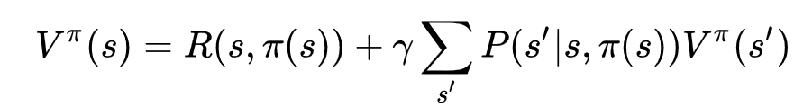
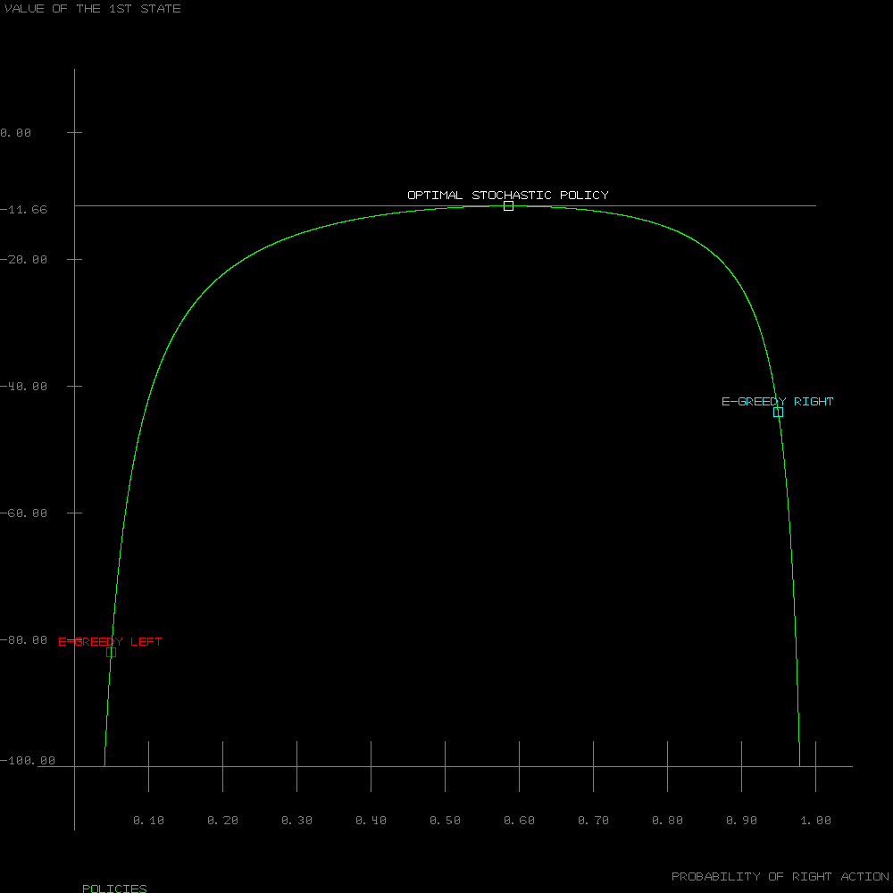
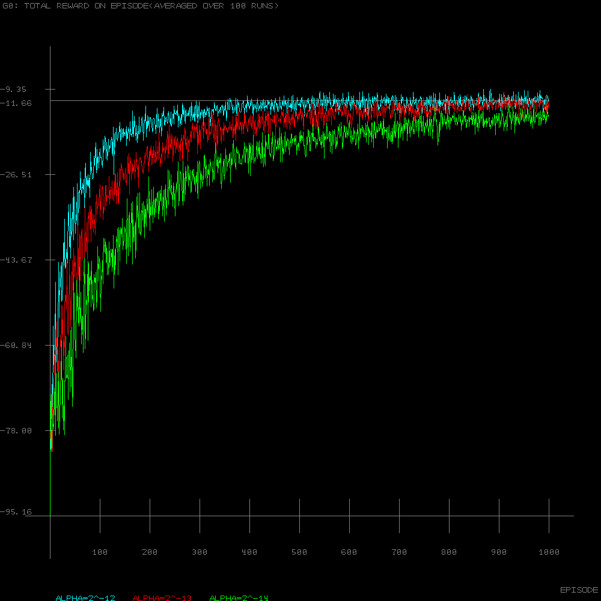
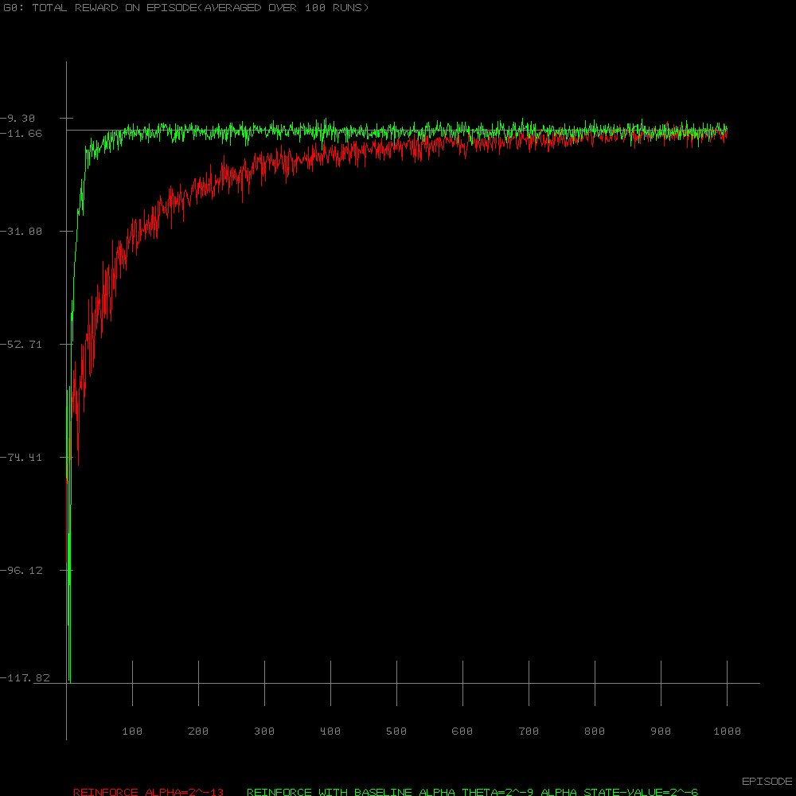
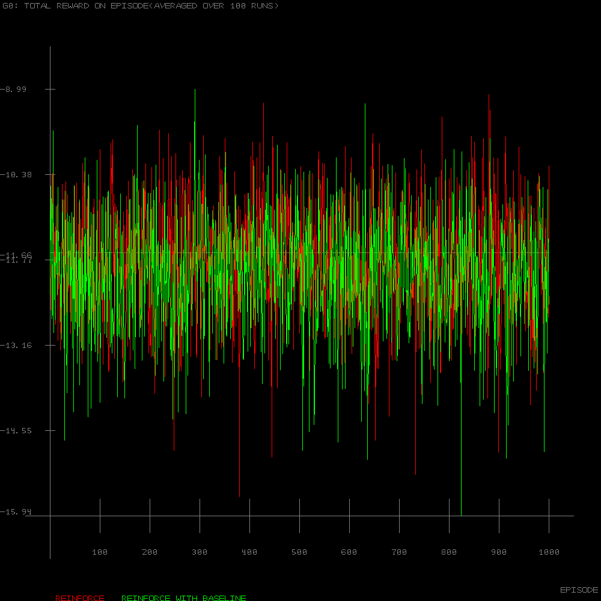
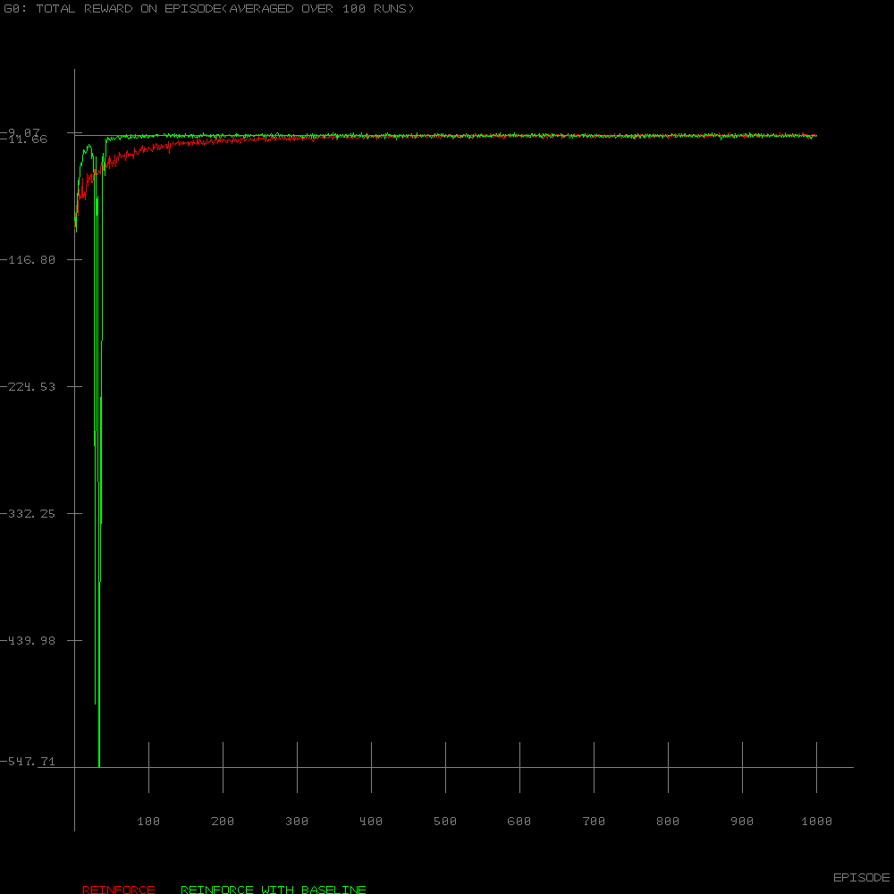

# Policy Gradient Methods

<b>Chapter 13: Reinforcement Learning: An Introduction(2nd edition) by Sutton &amp; Barto</b>

# Short Corridor

This is reporoduction of the figures from the book. Bitmap saving is implemented in pure Lua and is very slow!

For the example figure the Bellman equation can be used:

where gamma in our case is 1, reward R(s) is always -1 and we have only 2 actions(LEFT and RIGHT). For the Epsilon-Greedy policy we have:
  
        Probability(RIGHT) = 1 - Epsilon / 2
  
        Probability(LEFT) = Epsilon / 2
  
 If substitution is made for p = Epsilon / 2 and replacing it in the Bellman equation we have
 
        V(0) = -1 + Probability(LEFT) * V(0) + Probability(RIGHT) * V(1)
 
        V(0) = -1 + p * V(0) + (1 - p) * V(1)
 
 since going LEFT leaves us in the same start state and going RIGHT leads us to the next state(the reversed one). After rearrangement V(0) will be a function of V(1) using p. In similar fashion:
 
        V(1) = -1 + p * V(2) + (1 - p) * V(0)
 
 Here this is the reversed state so going LEFT leads us to state 2 and going RIGHT to the start state 0. We already have V(0) expressed as a function of V(1) so we will get similar equation for V(1) expressed as a function of V(2). Using the same trick for V(2) and knowing that V(3)=0 since it is the terminal state we can find the value of V(2) using only p. Going back and replacing V2 into V1 and V1 into V0 we will have
 
        V(0) = 2 * (2 - p) * (p * ( p - 1) )
 
 Which renders the graph from Example 13.1:

REINFORCE algorithm results are giving exactly the opposite other for alpha step sizes without any clue why:

REINFORCE with Baseline results are correct though:

I have some incosistencies with the initial values for Thetas. In the book they say they can be initialized with arbitrary values, e.g. 0. However if I do that I get very confusing results both for REINFORCE and REINFORCE with Baseline:

To get the proper results I had to initialize Theta to correspond to Epsilon-Greedy policy. This can be achieved by taking into account that using action preferences:

        Probability(LEFT)  = e^Theta[1] / (e^Theta[1] + e^Theta[2])
        Probability(RIGHT) = e^Theta[2] / (e^Theta[1] + e^Theta[2])
        
Solving for example the second one(using p=Epsilon / 2) and the fact that Probability(RIGHT)=p and the two probabilities sum to 1:
        
        Theta[1] = ln(p / (1 - p)) + Theta[2]
        
So giving Theta[2] any value and using the offset above to calculate Theta[1] produces the results from the book. To give an explicit solution additional constrain may be set, e.g. 

        Theta[1] = -Theta[2]

Combining last two equations and say Epsilon=0.1 gives:
        
        Theta = [-1.47, 1.47]
        
This though produces some glitch in the REINFORCE with Baseline:

The first attempt to fix this was a little change in the pseudo code given in the book for the algorithm. Originally both the W and Theta vectors there are using the same Delta value to update themselves. However if after updating the W vector the Delta value is recalculated and the new one is used to update the Theta vector the glitch disappears:

The second attempt was actually realizing that this was due to rounding error. If Theta[2] was going to be rounded to 1.47 then using -1.47 was way too off from the appropirate value using the ln(p / (1 - p)) as an offset. The actual values should be:

        Theta = [-1.4744389791664403, 1.47]
        
By using them there were no need for recalculating the Delta value between the W and Theta updates.
        
And to wrap it up here is a comparison of the two Actor-Critic Policy Gradient algorithms(TD0 and Eligibility Traces) against themselves and the two REINFORCE algorithms. The TD0 is outperformed by the one with the traces which also is better than the REINFORCE algorithms:

