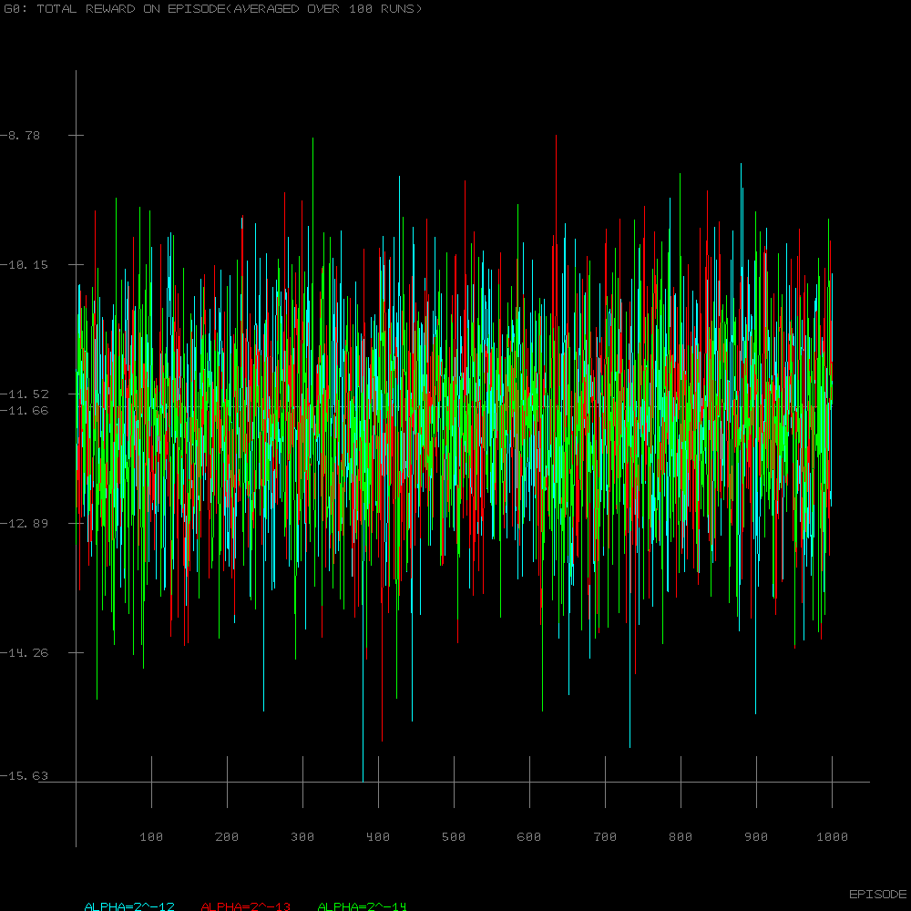

# Policy Gradient Methods

<b>Chapter 13: Reinforcement Learning: An Introduction(2nd edition) by Sutton &amp; Barto</b>

# Short Corridor

This is reporoduction of the figures from the the book. Bitmap saving is implemented in pure Lua and is very slow!

For the example figure the Bellman equation can be used:

where gamma in our case is 1, reward R(s) is always -1 and we have only 2 actions(LEFT and RIGHT). For the Epsilon-Greedy policy we have:
  
  Probability(RIGHT) = Epsilon / 2
  
  Probability(LEFT) = 1 - Epsilon / 2
  
 If substitution is made for p = Epsilon / 2 and replace it in the Bellman equation we have
 
 V(0) = -1 + Probability(LEFT) * V(0) + Probability(RIGHT) * V(1)
 
 V(0) = -1 + (1 - p) * V(0) + p * V(1)
 
 since going LEFT leaves in the same start state and going RIGHT leads us to the next state(the reversed one). After rearrangement V(0) will be a function of V(0) using p. In similar fashion:
 
 V(1) = -1 + (1 - p) * V(2) + p * V(0)
 
 Here this is the reversed state so going LEFT leads us to state 2 and going RIGHT to the start state 0. We already have V(0) expressed as a function of V(0) so we will get similar equation for V(1) expressed as a function of V(2). Using the same trick for V(2) and knowing that V(3)=0 since it is the terminal state we can find the value of V(2) using only p. Going back and replacing V2 into V1 and V1 into V0 we will have
 
 V(0) = 2 * (2 - p) * (p * ( p - 1) )
 
 Which renders the graph from Example 13.1:

